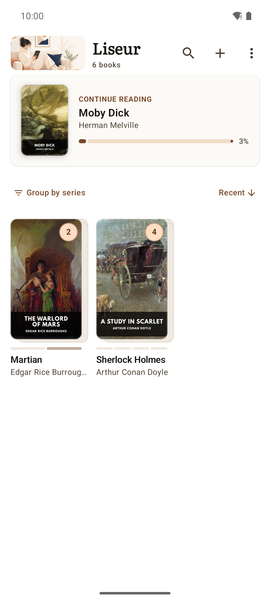
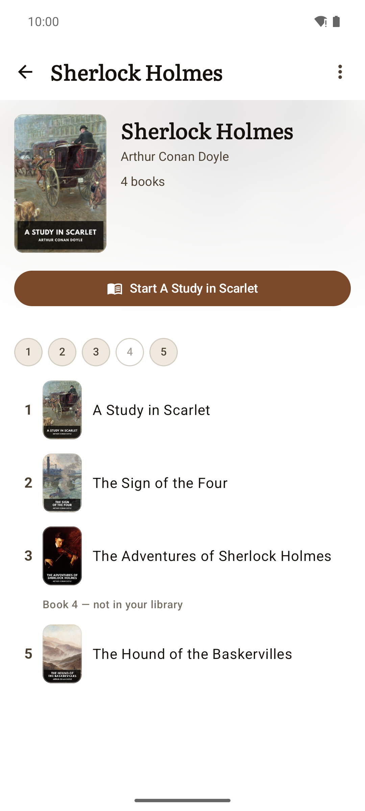
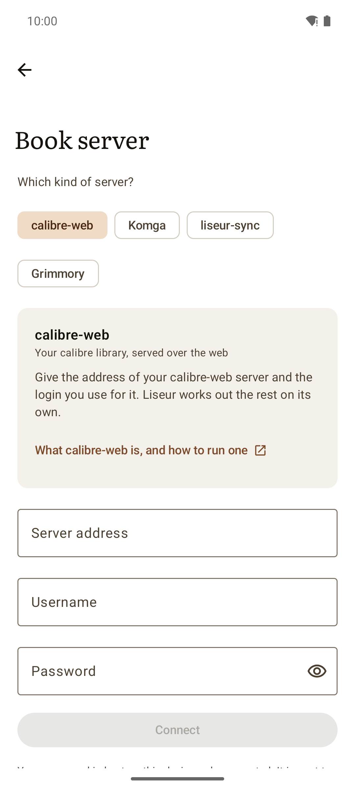

# Liseur

  <picture>
    <source media="(prefers-color-scheme: dark)" srcset="docs/banner-dark.png">
    
  </picture>

An open-source ebook reader for Android and a [calibre-web](https://github.com/janeczku/calibre-web) / [Komga](https://komga.org) / [liseur-sync](https://github.com/chmouel/liseur-sync) client: EPUBs on your phone, in sync with your own book server, for people whose idea of a great evening is a warm blanket and a 900-page book.

<table>
  <tr>
    <td width="25%"></td>
    <td width="25%"></td>
    <td width="25%"></td>
    <td width="25%"></td>
  </tr>
  <tr>
    <td align="center">The shelf, sorted by what you are currently reading.</td>
    <td align="center">Distraction-free page with notes and bookmarks.</td>
    <td align="center">Reading progress, chapter scrubber, and time remaining.</td>
    <td align="center">Themes, open typefaces, spacing, and brightness.</td>
  </tr>
  <tr>
    <td></td>
    <td></td>
    <td></td>
    <td></td>
  </tr>
  <tr>
    <td align="center">Full-screen table of contents for easy navigation.</td>
    <td align="center">A personal notebook of highlights, exportable to Markdown.</td>
    <td align="center">In-book search with context snippets.</td>
    <td align="center">Instant word definitions without losing your place.</td>
  </tr>
  <tr>
    <td></td>
    <td></td>
    <td></td>
    <td></td>
  </tr>
  <tr>
    <td align="center">Series grouped into compact shelf stacks.</td>
    <td align="center">Reading order, progress, and missing volumes at a glance.</td>
    <td align="center">Connect to calibre-web, Komga or liseur-sync in moments.</td>
    <td align="center">Dark reading theme, independent of system settings.</td>
  </tr>
</table>

Screenshots use <a href="https://standardebooks.org">Standard Ebooks</a> editions (public domain).

## About Liseur

[Liseur](#whats-in-a-name) is designed to get out of the way and let you read.
Pages open cleanly from edge to edge with the Readium engine, set in open
typefaces like Literata, Vollkorn, Atkinson Hyperlegible, and Inter, or
whatever quirky typography the publisher insisted on. Four dedicated reading
themes (Light, Sepia, Dark, and true OLED Black) let you settle into a story at
2 a.m. without being blinded by your phone. Margins, line spacing, brightness,
and page turns stay quietly out of your way. Prefer one long scroll to turning
pages? Switch it on for the whole library, or for the one book that wants it,
and keep scrolling past the end of a chapter to fall into the next one.

A discreet footer shows the time remaining in the chapter (just enough to
convince yourself that one more chapter won't hurt), while highlights, margin
notes, bookmarks, and instant dictionary lookups remain right under your
fingers when you stumble upon a word you pretend to know. Footnotes open as a
small card over the page rather than throwing you to the back of the book, so
an author's aside costs you nothing more than a tap — and when a note is long
enough to deserve the full page, "Go to note" takes you there and leaves a way
back.

Your library gathers onto a single shelf, whether your books live in messy folders on your phone or on a self-hosted [calibre-web](https://github.com/janeczku/calibre-web), [Komga](https://komga.org) or [liseur-sync](https://github.com/chmouel/liseur-sync) server. Books that belong to a series politely group into compact stacks that track your reading order, your progress, and the missing volumes you still need to hunt down. When you reach the final page of a novel, the next volume is already sitting there, gently enabling your binge-reading habits.

When you switch between devices, you have the choice to have your place travel with you across your devices. Two-way synchronization with [calibre-web](https://github.com/janeczku/calibre-web), [Komga](https://komga.org) and [liseur-sync](https://github.com/chmouel/liseur-sync) keeps your progress aligned — down to the exact sentence on Komga and liseur-sync, so you never have to play the guessing game of where you were. liseur-sync goes one further: standalone EPUB files that never came from a catalog sync their position too, matched by the file itself. Its books come from folders it watches on the server, so anything you drop there shows up on the shelf.

Everything runs privately and without distraction. There are no trackers, no
analytics, no ads, and no attempts to sell you a monthly subscription for books
you already own. Liseur only talks to the book servers and dictionary sources
you choose to add. The [privacy policy](https://chmouel.github.io/liseur/PRIVACY)
spells out exactly what that means.

## Install

- [F-Droid](https://f-droid.org/en/packages/com.chmouel.liseur/)
- [GitHub Releases](https://github.com/chmouel/liseur/releases)

## Related Projects

- [liseur-desktop](https://github.com/chmouel/liseur-desktop): Desktop version of Liseur
- [liseur-sync](https://github.com/chmouel/liseur-sync): Lightweight self-hosted library and sync server — watched folders, browse, download, positions and reading stats

## Development

See [DEVELOPER.md](DEVELOPER.md) for build instructions and architecture notes.
What each supported server exposes, what is implemented against it, and
why the remaining gaps are or are not fixable is in
[`docs/SERVER_CAPABILITIES.md`](docs/SERVER_CAPABILITIES.md).

## What's in a name?

**Liseur** ([li.zœʁ], *lee-ZUR*) is the French word for an avid reader or book lover. It sounds dignified just like the English word *leisure*, which is exactly what you should be doing when you curl up with a good book.

Here is a painting of Pierre-August Renoir portraying C.Monet as "Le liseur"

.jpg)
## Author

### Chmouel Boudjnah

- Fediverse - <[@chmouel@chmouel.com](https://fosstodon.org/@chmouel)>
- Twitter - <[@chmouel](https://twitter.com/chmouel)>
- Blog  - <[https://blog.chmouel.com](https://blog.chmouel.com)>

## Licence

[MIT](LICENSE). Bundled fonts are under the SIL Open Font License.
