# Liseur

An open-source EPUB reader and calibre-web client for Android: a modern
reader that is equally at home with the files on your phone and with a
[calibre-web](https://github.com/janeczku/calibre-web) server.

<table>
  <tr>
    <td width="25%">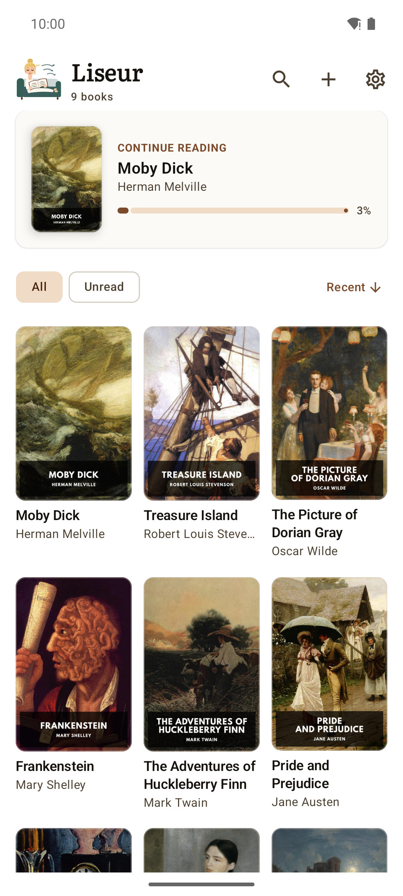</td>
    <td width="25%">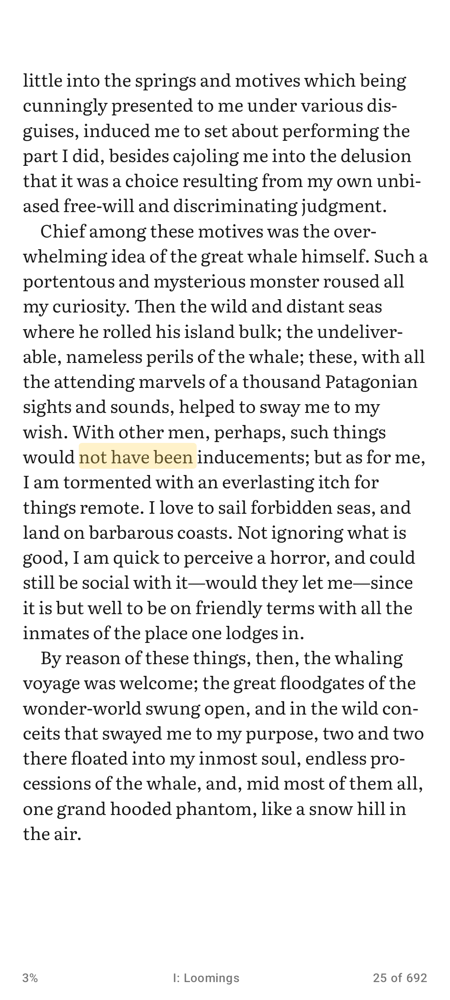</td>
    <td width="25%">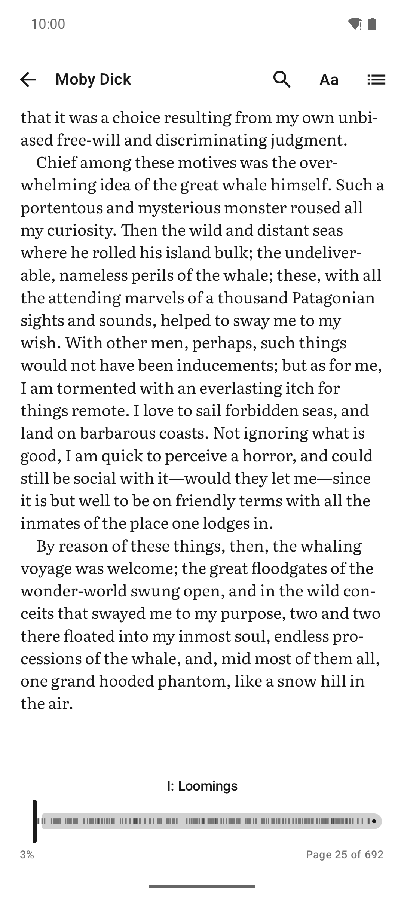</td>
    <td width="25%">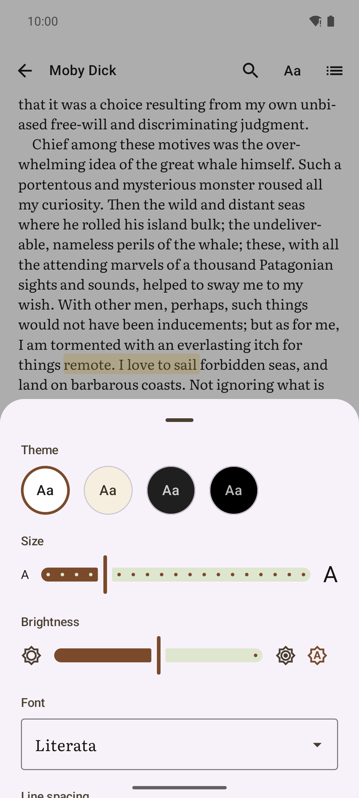</td>
  </tr>
  <tr>
    <td align="center">The shelf, with whatever you were last reading on top.</td>
    <td align="center">A full page of text, a highlight, a bookmark ribbon.</td>
    <td align="center">Tap the middle for progress, the scrubber and time left.</td>
    <td align="center">Reading themes, fonts, size, spacing, brightness.</td>
  </tr>
  <tr>
    <td>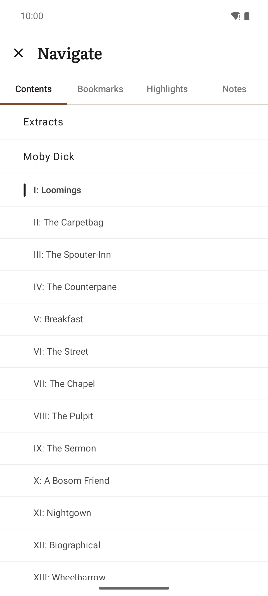</td>
    <td>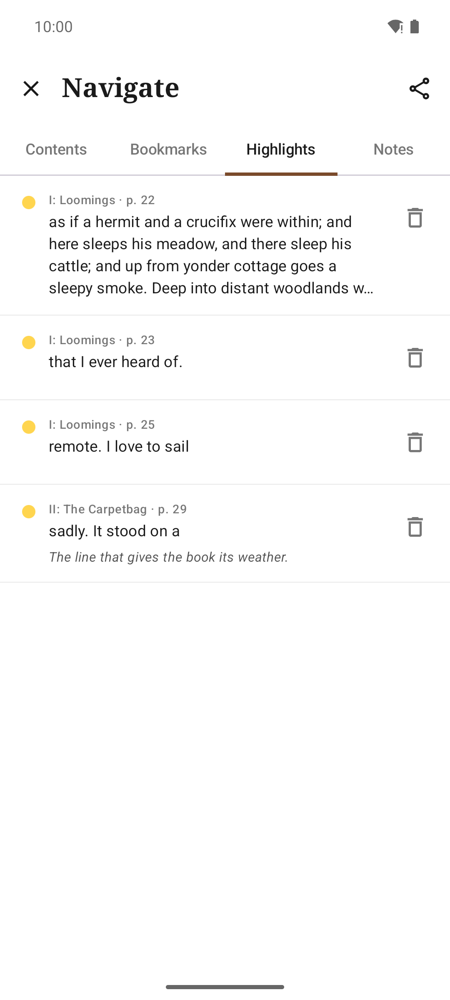</td>
    <td>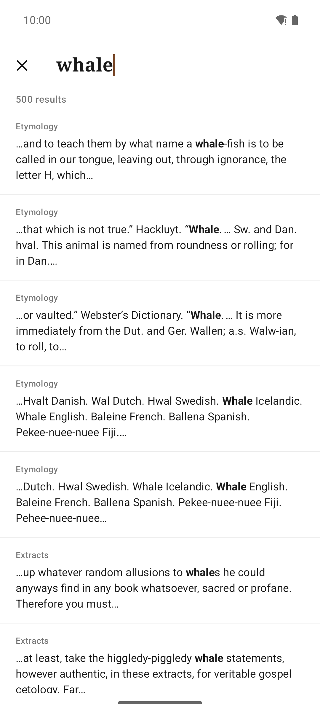</td>
    <td>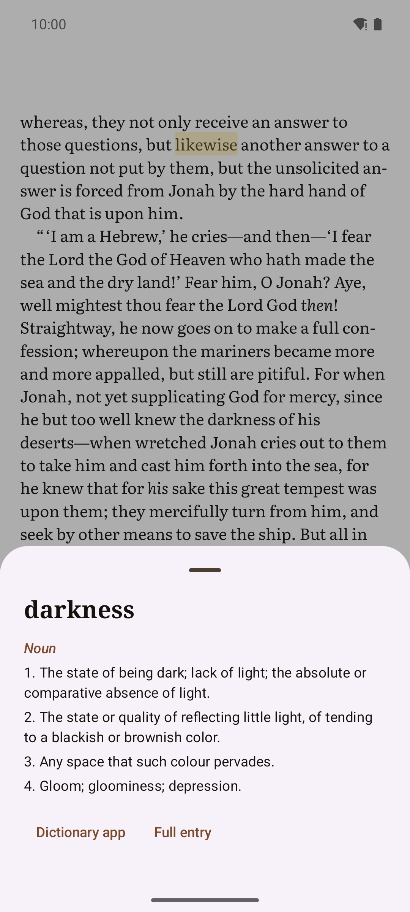</td>
  </tr>
  <tr>
    <td align="center">Contents on a full screen, so long books stay navigable.</td>
    <td align="center">Everything you marked up, exportable as Markdown.</td>
    <td align="center">Search the whole book, with a snippet around each hit.</td>
    <td align="center">Hold a word for a definition, without leaving the page.</td>
  </tr>
  <tr>
    <td>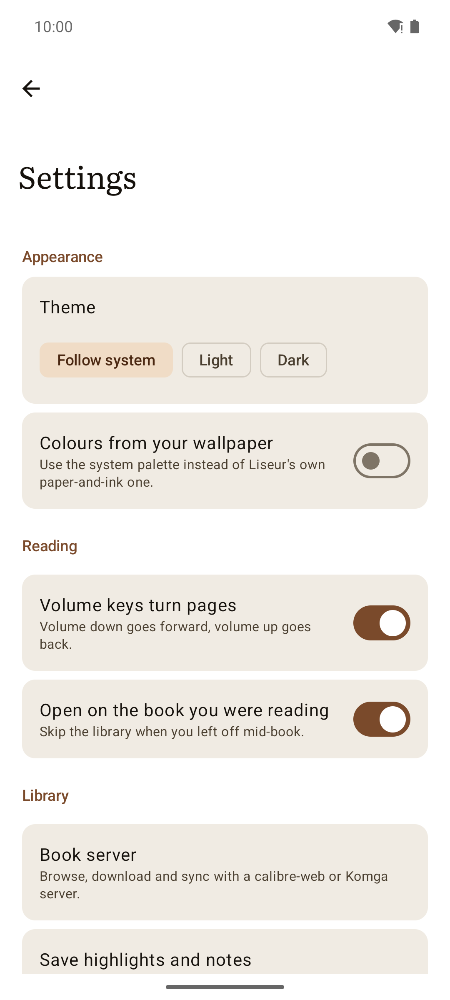</td>
    <td>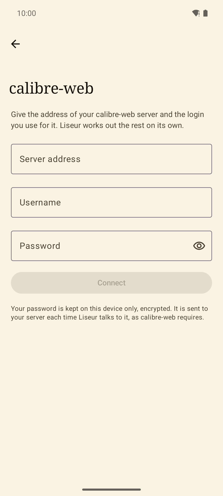</td>
    <td>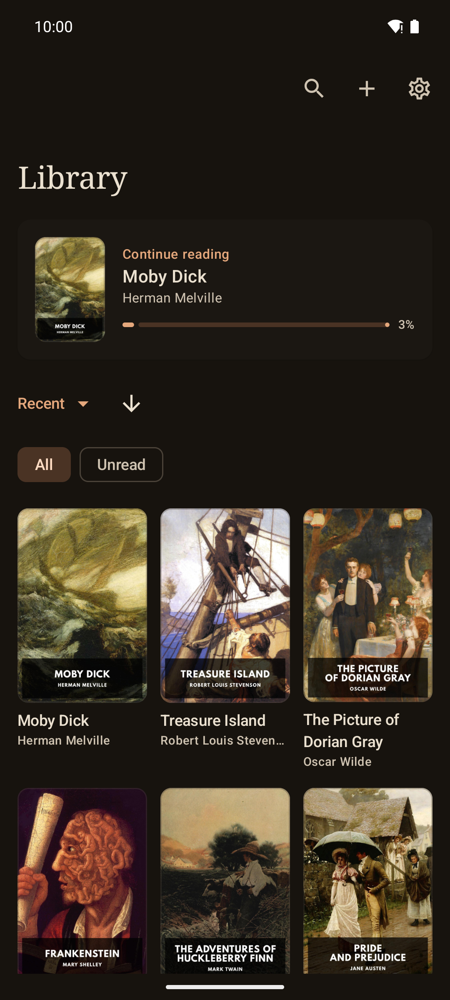</td>
    <td>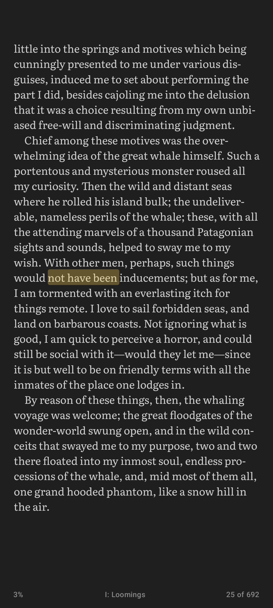</td>
  </tr>
  <tr>
    <td align="center">Theme, volume keys, and where your books come from.</td>
    <td align="center">An address, a username, a password. Liseur works out the rest.</td>
    <td align="center">The same shelf after dark.</td>
    <td align="center">The Dark page theme, chosen separately from the app's.</td>
  </tr>
</table>

Screenshots use <a href="https://standardebooks.org">Standard Ebooks</a>
editions, which are in the public domain.

## What it does

Reading. Read an EPUB rendered full screen. Tap the
right of the page to go forward, the left to go back, the middle to bring up
the chrome; volume keys work too if you would rather not touch the screen.

Typography. Four reading themes (Light, Sepia, Dark, Black) that are
independent of the app's own theme, four bundled open fonts (Literata,
Vollkorn, Atkinson Hyperlegible, Inter) or the publisher's own, plus size, line
spacing, margins and an in-app brightness slider.

Where you are. A footer that shows time left in the chapter, time left in the
book, page, or percentage; tap it to cycle. A scrubber with chapter ticks, and
a pill that takes you back if you jumped somewhere by accident.

Marking up. Highlights in four colours, notes, bookmarks with a Kindle-style
corner ribbon, and a notebook of everything you have marked in a book,
exportable as Markdown.

Looking things up. Search the whole book with snippets and jump-to
highlighting, and a Wiktionary definition card on any selected word, with a
hand-off to an offline dictionary app if you have one.

Your library. Point Liseur at folders of EPUBs and it indexes them, covers and
all. Books you are actually using sort to the front, finished ones get a tick,
and pull to refresh picks up whatever changed behind the app's back.

calibre-web. One screen: URL, username, password. Liseur works out the rest
(the OPDS catalog, whether the account may download, and the Kobo sync token),
then merges your server's books into the same library with a cloud badge. Tap
one and it downloads and opens. Reading positions sync both ways through
calibre-web's Kobo protocol. You can remove the copy on the device, or delete
the book from the server outright.

Free software. No trackers or analytics, no proprietary dependencies. The only
network traffic is to the calibre-web server you configured and, if you ask for
a definition, to Wiktionary.

## Development

***See [DEVELOPER.md](DEVELOPER.md) for how to build Liseur from source.***

## Author

### Chmouel Boudjnah

- Fediverse - <[@chmouel@chmouel.com](https://fosstodon.org/@chmouel)>
- Twitter - <[@chmouel](https://twitter.com/chmouel)>
- Blog  - <[https://blog.chmouel.com](https://blog.chmouel.com)>

## Licence

[MIT](LICENSE). Bundled fonts are under the SIL Open Font License.
