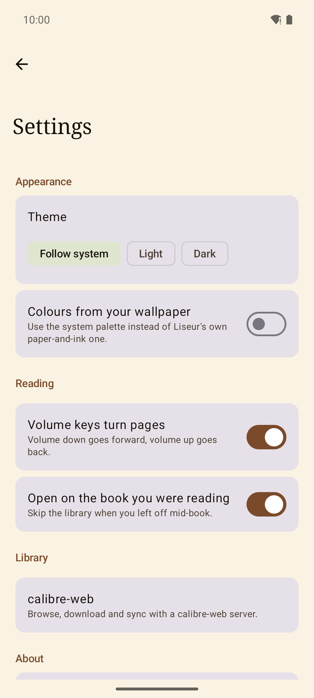

# Liseur

A quiet place to read your books: a modern Android EPUB reader that is
equally at home with the files on your phone and with a
[calibre-web](https://github.com/janeczku/calibre-web) server.

<p align="center">
  
  
  
  
</p>

## What it does

**Reading.** Paginated EPUB rendering through the [Readium Kotlin
Toolkit](https://readium.org/kotlin-toolkit/), full screen by default.
Tap the right of the page to go forward, the left to go back, the middle
to bring up the chrome; volume keys work too if you would rather not
touch the screen. A whole page always fits the screen — no stray
scrolling to catch the last line.

**Typography.** Four reading themes (Light, Sepia, Dark, Black) that are
independent of the app's own theme, four bundled open fonts (Literata,
Vollkorn, Atkinson Hyperlegible, Inter) or the publisher's own, plus
size, line spacing, margins and an in-app brightness slider.

**Where you are.** A footer that shows time left in the chapter, time
left in the book, page, or percentage — tap it to cycle. A scrubber with
chapter ticks, and a pill that takes you back if you jumped somewhere by
accident.

**Marking up.** Highlights in five colours, notes, bookmarks with a
Kindle-style corner ribbon, and a notebook of everything you have marked
in a book, exportable as Markdown.

**Looking things up.** Search the whole book with snippets and jump-to
highlighting, and a Wiktionary definition card on any selected word —
with a hand-off to an offline dictionary app if you have one.

**Your library.** Point Liseur at folders of EPUBs and it indexes them,
covers and all. Books you are actually using sort to the front, finished
ones get a tick, and pull to refresh picks up whatever changed behind the
app's back.

**calibre-web.** One screen: URL, username, password. Liseur works out
the rest — the OPDS catalog, whether the account may download, and the
Kobo sync token — then merges your server's books into the same library
with a cloud badge. Tap one and it downloads and opens. Reading positions
sync both ways through calibre-web's Kobo protocol. You can remove the
copy on the device, or delete the book from the server outright.

**Free software.** No trackers, no analytics, no proprietary
dependencies. The only network traffic is to the calibre-web server you
configured and, if you ask for a definition, to Wiktionary.

## Building

```bash
./gradlew assembleDebug            # app/build/outputs/apk/debug/
./gradlew testDebugUnitTest lintDebug
```

Requires JDK 17. See [DEVELOPER.md](DEVELOPER.md) for the architecture,
the calibre-web protocol notes, and the release process.

## Licence

[MIT](LICENSE). Bundled fonts are under the SIL Open Font License.
