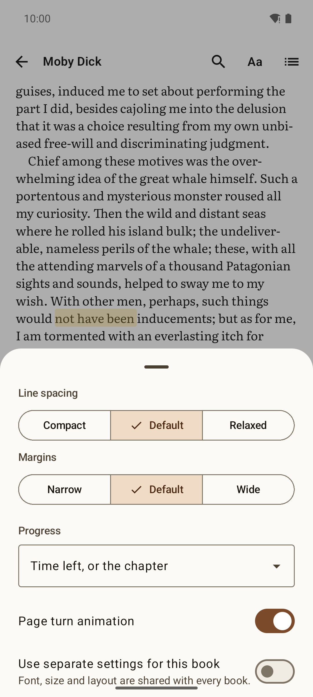
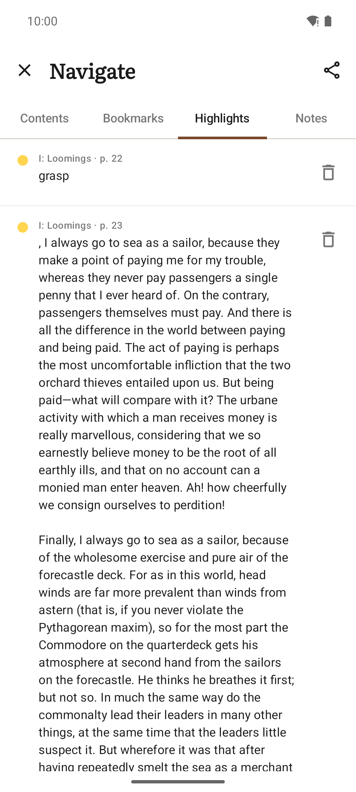
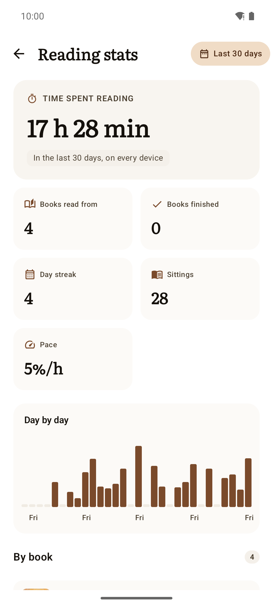
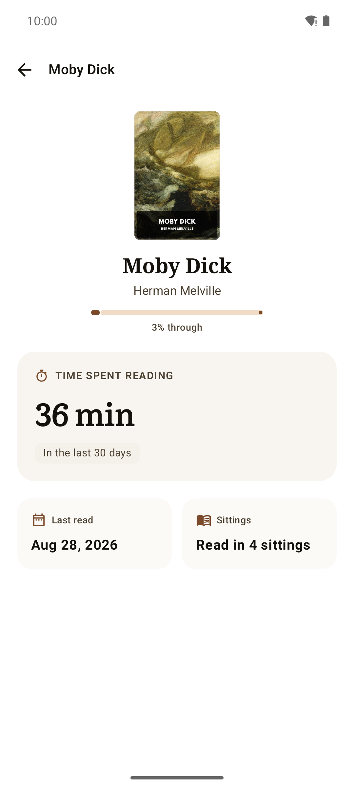
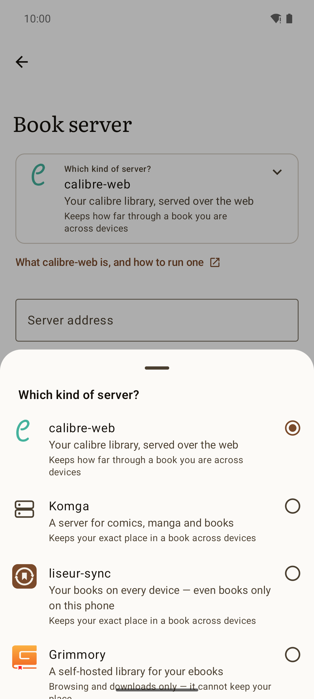
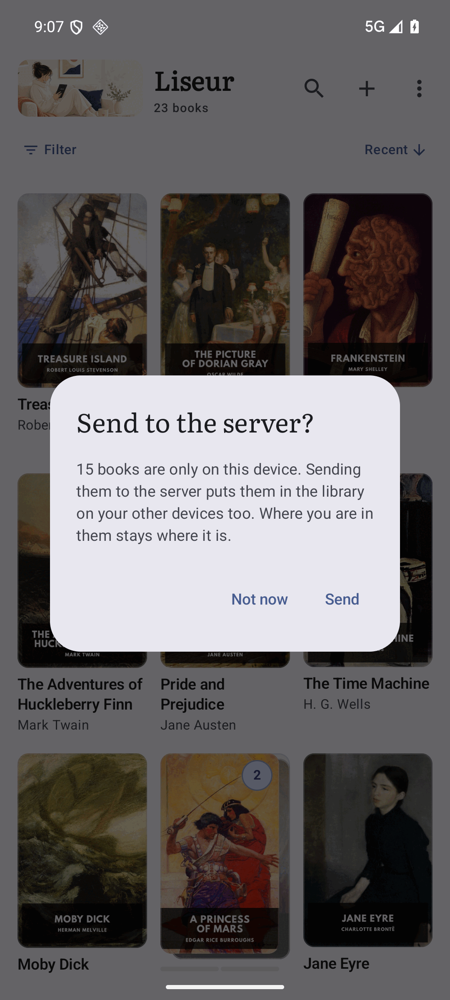
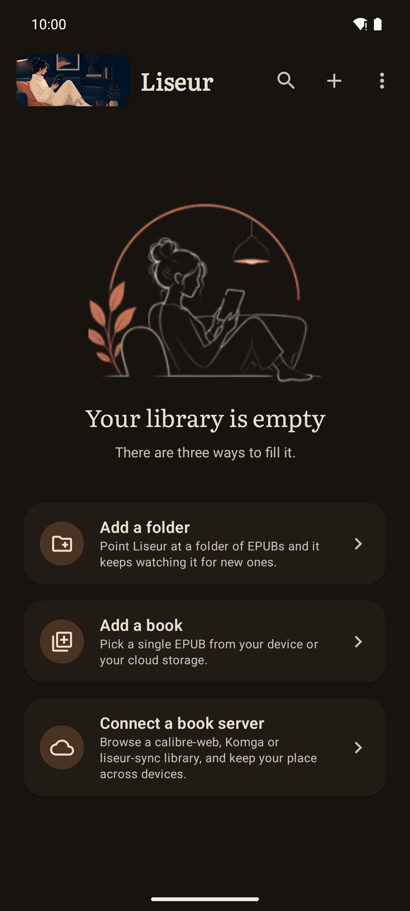
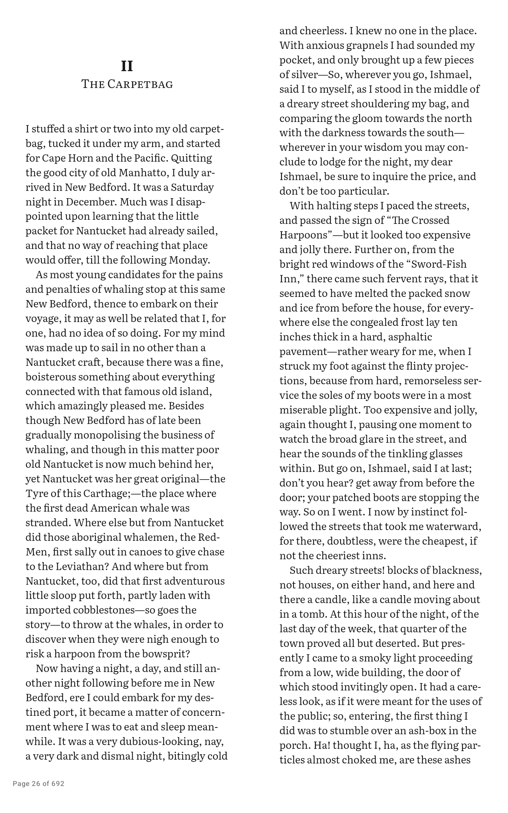
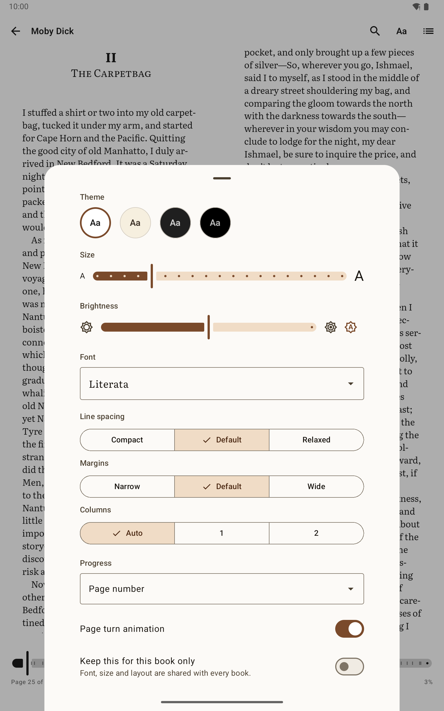
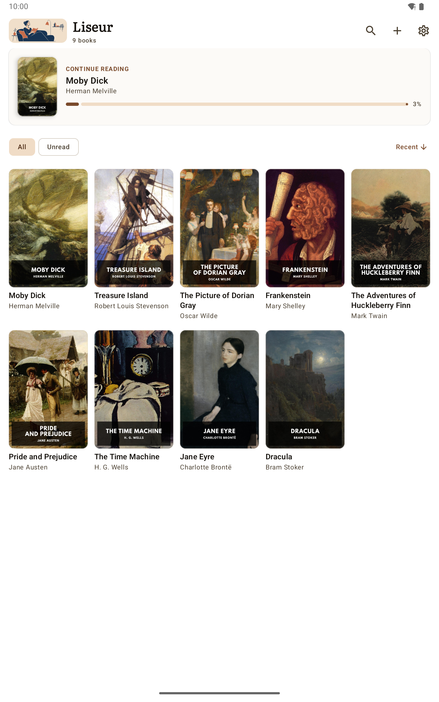

# Screenshots

Every screen Liseur has a picture of, captured with `hack/screenshots`
against an emulator carrying a shelf of [Standard Ebooks](https://standardebooks.org)
editions (public domain, cover art included). The README shows three of
them; the rest are here.

## Reading

<table>
  <tr>
    <td width="33%"></td>
    <td width="33%"></td>
    <td width="33%"></td>
  </tr>
  <tr>
    <td align="center">The page, with nothing on it but the book.</td>
    <td align="center">Progress, chapter scrubber, and how long is left.</td>
    <td align="center">The table of contents, full screen.</td>
  </tr>
  <tr>
    <td></td>
    <td></td>
    <td></td>
  </tr>
  <tr>
    <td align="center">Theme, size, brightness, typeface, and how the book is read.</td>
    <td align="center">Everything set once, if ever, a tap further in.</td>
    <td align="center">In-book search, with the line each hit sits on.</td>
  </tr>
</table>

## Marks and lookups

<table>
  <tr>
    <td width="33%"></td>
    <td width="33%"></td>
    <td width="33%"></td>
  </tr>
  <tr>
    <td align="center">The notebook: highlights, notes and bookmarks, exportable to Markdown.</td>
    <td align="center">A passage longer than the list shows, read in full where it is.</td>
    <td align="center">A definition without leaving the page. Off until you turn it on.</td>
  </tr>
</table>

## The shelf

<table>
  <tr>
    <td width="33%"></td>
    <td width="33%"></td>
    <td width="33%"></td>
  </tr>
  <tr>
    <td align="center">Sorted by what you are reading now.</td>
    <td align="center">Series gathered into stacks.</td>
    <td align="center">Reading order, progress, and which volumes are missing.</td>
  </tr>
</table>

## Reading stats

<table>
  <tr>
    <td width="33%"></td>
    <td width="33%"></td>
    <td width="33%"></td>
  </tr>
  <tr>
    <td align="center">Hours, sittings, streak, and the days they landed on.</td>
    <td align="center">One book: the pace you read it at, and what is left.</td>
    <td></td>
  </tr>
</table>

Counted from the moment you open a book, on this device. Nothing is
guessed about reading you did before Liseur arrived.

## Setting up

<table>
  <tr>
    <td width="33%"></td>
    <td width="33%"></td>
    <td width="33%"></td>
  </tr>
  <tr>
    <td align="center">One server at a time, with your own credentials.</td>
    <td align="center">calibre-web, Komga, liseur-sync or Grimmory, and what each carries.</td>
    <td align="center">A book only on this phone, offered to a server that takes uploads.</td>
  </tr>
  <tr>
    <td></td>
    <td></td>
    <td></td>
  </tr>
  <tr>
    <td align="center">Everything else.</td>
    <td align="center">Three ways to fill a new shelf.</td>
    <td></td>
  </tr>
</table>

## In the dark

<table>
  <tr>
    <td width="33%"></td>
    <td width="33%"></td>
    <td width="33%"></td>
  </tr>
  <tr>
    <td align="center">The shelf follows the system theme.</td>
    <td align="center">The reading theme does not have to: Light, Sepia, Dark and OLED Black are the book's own.</td>
    <td align="center">A new shelf, after dark.</td>
  </tr>
</table>

## On a tablet

<table>
  <tr>
    <td width="33%"></td>
    <td width="33%"></td>
    <td width="33%"></td>
  </tr>
  <tr>
    <td align="center">A wide page laid out in two columns.</td>
    <td align="center">One column or two, or let the width decide.</td>
    <td align="center">More books to a screen, same shelf.</td>
  </tr>
</table>

---

These are captured, not composed: `hack/screenshots --setup` builds the
demo shelf, reads a book part-way, marks it up, and photographs the
result. See the header of that script for how to run it.
